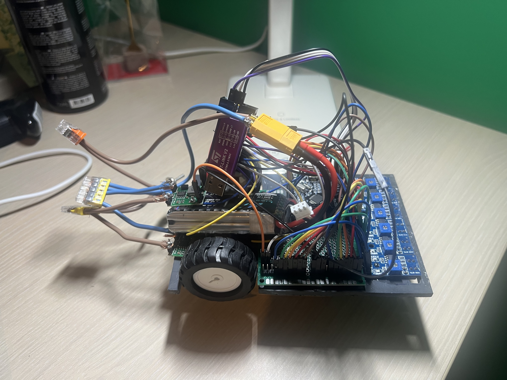

# Line Follower Robot

Dit project bevat het ontwerp en de realisatie van een snelle autonome line-following robot voor het Syntheseproject Automatisering.

Het gerealiseerde prototype is een Plan-B-uitvoering en gebruikt zes analoge reflectiesensoren om een zwarte lijn op een witte ondergrond te volgen.

## Specificaties

- Microcontroller: STM32F103C8T6
- Motoren: 2 × GA12-N20, 6 V, 300 rpm
- Motordriver: TB6612FNG dubbele H-brug
- Lijnsensoren: 6 × TCRT5000
- Batterij: 2S LiPo, 7,4 V, 1500 mAh, 45C
- Voedingsregeling: 2 × MP1584EN buckconverter
- Logicaspanning: 3,3 V
- Motorvoeding: 5 V
- Wielen: diameter 44 mm
- Chassis: PVC, 4 mm dik
- Chassisbreedte: 100 mm
- Chassislengte: 147 mm
- Bluetoothmodule: HM-10
- EEPROM: 24LC256

## Werking

De zes TCRT5000-sensoren worden analoog uitgelezen door de ADC van de STM32.

Op basis van de gemeten sensorwaarden wordt de positie van de zwarte lijn bepaald. De STM32 past vervolgens via PWM de snelheid van beide motoren onafhankelijk aan.

De lijncorrectie is proportioneel met de gemeten afwijking van de lijn. In de definitieve software wordt een proportionele correctiefactor van `0,50` gebruikt.

De software maakt onderscheid tussen rechte stukken en bochten. Op rechte stukken wordt een hogere basissnelheid gebruikt en in bochten wordt deze snelheid verlaagd.

Bij detectie van een brede zwarte zone wordt deze als kruispunt beschouwd. De normale lijncorrectie wordt dan tijdelijk uitgeschakeld en beide motoren krijgen dezelfde snelheid, zodat de robot rechtdoor over het kruispunt rijdt.

## Repository

De belangrijkste onderdelen van het project zijn terug te vinden in de volgende mappen:

- `bill of materials` – volledige onderdelenlijst en voedingsverdeling
- `code/finaal` – finale software van de line follower
- `code/proof of concepts/hbridge` – proof of concept van de motorsturing
- `code/proof of concepts/sensor` – proof of concept van de zes lijnsensoren
- `datasheets` – datasheets van de gebruikte componenten
- `gebruiksaanwijzing` – gebruiksaanwijzing van de robot
- `images` – foto's van het gerealiseerde prototype
- `instructable` – stappenplan om de robot na te bouwen
- `technische tekeningen/elektronisch` – elektronisch schema
- `technische tekeningen/mechanisch` – mechanisch ontwerp

## Line-following software

De belangrijkste parameters van de definitieve werkende software zijn:

- snelheid recht stuk: `300`
- snelheid bocht: `150`
- grenswaarde bochtdetectie: `120`
- maximale motorsnelheid in software: `600`
- proportionele correctiefactor: `0,50`
- kruispuntdetectie: minimaal `3` sensoren detecteren zwart
- kruispunt vrijgave: `300` meetcycli

Alle zes lijnsensoren worden door de STM32 uitgelezen.

In de huidige finale software worden de eerste vijf sensoren gebruikt voor de berekening van de lijnpositie en de kruispuntdetectie.

De zesde sensor wordt wel uitgelezen, maar niet meegenomen in deze berekeningen wegens een foutieve hoge meetwaarde op wit in de gemonteerde opstelling.

## Motorsturing

De twee GA12-N20 DC-motoren worden onafhankelijk aangestuurd via de TB6612FNG.

De snelheid van beide motoren wordt geregeld met PWM.

Bij normale lijnvolging wordt de motorsnelheid bepaald volgens:

`motor A = basissnelheid + correctie`

`motor B = basissnelheid - correctie`

waarbij:

`correctie = 0,50 × lijnpositie`

## Kruispunten

Wanneer minimaal drie van de gebruikte lijnsensoren tegelijk zwart detecteren, wordt dit als een brede zwarte zone of kruispunt beschouwd.

Tijdens de kruispuntmodus:

- wordt de normale lijncorrectie tijdelijk uitgeschakeld;
- krijgen beide motoren dezelfde snelheid;
- rijdt de robot rechtdoor;
- wordt pas na meerdere normale meetcycli terug overgeschakeld naar de gewone lijnregeling.

Met de definitieve instellingen neemt het prototype het kruispunt correct rechtdoor.

## Huidige uitvoering

Het Plan-B-prototype wordt in- en uitgeschakeld met een bistabiele tuimelschakelaar.

Als derde steunpunt onder het chassis wordt een LEGO-gezichtje gebruikt dat reeds thuis beschikbaar was en als glijsteun over het parcours beweegt.

De HM-10 Bluetoothmodule en 24LC256 EEPROM zijn voorzien in het elektronische ontwerp, maar worden niet actief gebruikt door de huidige finale lijnvolgsoftware.

Het uiteindelijke prototype heeft geen afzonderlijke START/STOP-drukknop en geen Power-on LED.

De parameters van de lijnregeling werden experimenteel afgesteld op het uiteindelijke prototype.

Met de definitieve instellingen volgt de robot de lijn stabiel, neemt hij het kruispunt correct rechtdoor en kan hij meerdere volledige rondes na elkaar afleggen.
